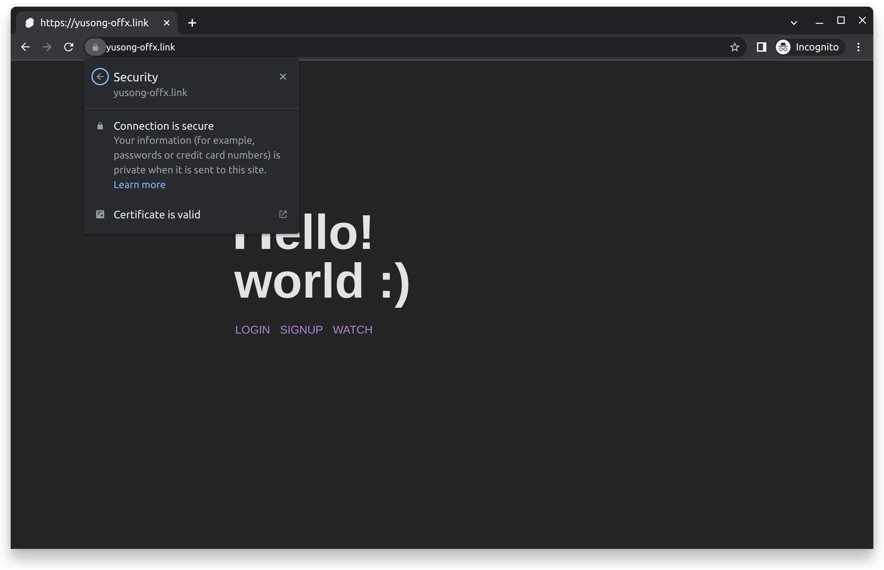
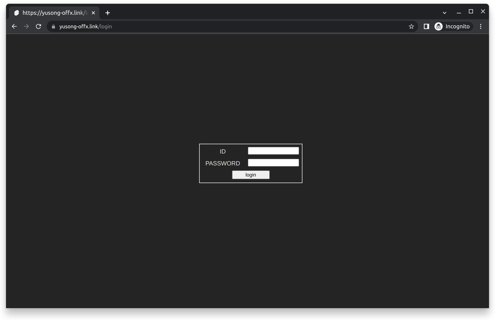
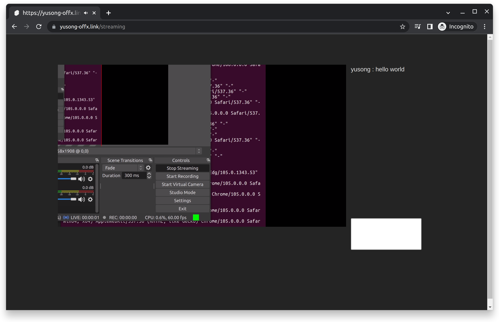

# study-mytwitch
### This is small project to study about web structure :)
You need to change host, if you want to execute project. (svelte fetch, nginx conf (server_name, not proxy))  
When you compose up, "/share/..." directories are automatically made.  
You can refer "docker-compose.yml" file for ssl location.
 

# feature
- adaptive live video streaming
- websocket chat
- login/out & signup (password hashed by bcrypt)
- reverse proxy by nginx
 

# skill
- docker-compose
- svelte
- fiber (golang)
- postgresql (pgadmin4)
 

# structure

  
\* There is only table USERS which has id and password columns.

site images

 

# next
- reduce live streaming delay through hardware accelation
- use normal schema (data models)
- use strong authentication and authorize
- use redis (for jwt, cache...)
- centralize log
- service by k8s
- video spreads by http3
 
